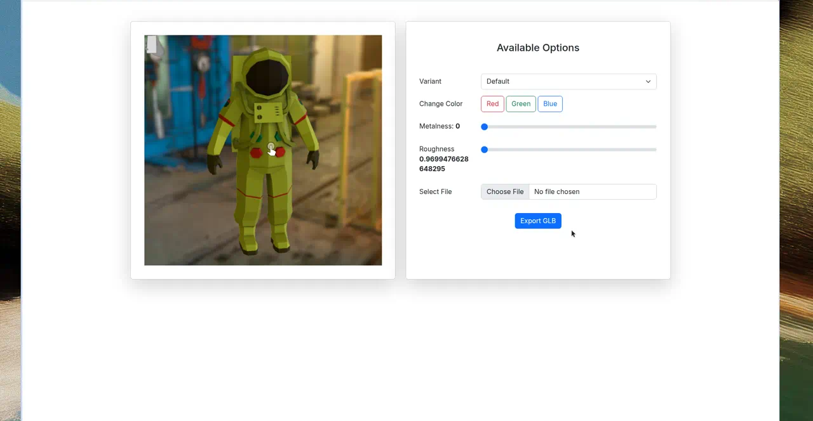

# Model Viewer Demo

An interactive 3D model viewer in the browser. Inspect a GLB model with orbit controls, switch materials, tweak metalness and roughness, enable AR on supported devices, and export the result as a new GLB file.



## Overview

This demo loads an astronaut GLB (with a USDZ fallback for iOS AR) inside Google’s `<model-viewer>` web component. A side panel lets you change variant, base color, metalness, and roughness, or replace the model with a file from disk. **Export GLB** downloads the edited scene.

## Tech stack

| Layer | Technology |
| --- | --- |
| Markup | HTML5 |
| 3D viewer | [@google/model-viewer](https://modelviewer.dev/) (loaded from unpkg) |
| UI | [Bootstrap 5](https://getbootstrap.com/) |
| AR | WebXR / Scene Viewer / Quick Look (`ar`, `ios-src`) |
| Assets | GLB, USDZ, HDR environment map |

## Features

- Interactive 3D preview with camera controls and touch orbit
- HDR environment lighting (`aircraft_workshop_01_1k.hdr`)
- AR mode on supported phones (`Activate AR`)
- Variant selector when the model defines variants
- Quick color presets (red, green, blue)
- Metalness and roughness sliders
- Load a local GLB / 3D file via **Select File**
- **Export GLB** of the current scene

## Dependencies

No npm install. Everything is loaded from CDN or shipped in the repo:

| Dependency | Version / source | Used for |
| --- | --- | --- |
| `@google/model-viewer` | unpkg CDN | 3D rendering, AR, export |
| Bootstrap | 5.2.1 (jsDelivr) | Layout and form controls |
| Popper.js | 2.11.6 (jsDelivr) | Bootstrap dropdowns |
| `Astronaut.glb` / `Astronaut.usdz` | local | Default model |
| `aircraft_workshop_01_1k.hdr` | local | Skybox / lighting |

## Run locally

Serve the folder over HTTP so the GLB and HDR files can load (do not open `index.html` as a `file://` URL).

```bash
git clone https://github.com/SalmanAAbir/model-viewer.git
cd model-viewer
python3 -m http.server 8080
```

Then visit http://localhost:8080

Alternatively:

```bash
npx --yes serve .
```

### Notes

- An internet connection is needed for the CDN copies of `<model-viewer>` and Bootstrap.
- AR typically requires HTTPS and a compatible mobile browser (Chrome on Android, Safari on iOS).
- Extra models in this repo (`Gioiello.glb`, `MaterialsVariantsShoe.glb`) can be loaded with **Select File**.

## Links

| | |
| --- | --- |
| Repository | https://github.com/SalmanAAbir/model-viewer |
| Live demo | No public host yet — run locally as above |
| model-viewer docs | https://modelviewer.dev/ |
| GLB / glTF spec | https://www.khronos.org/gltf/ |
